# SQL Graphs

Graphs for theory crafting and practical sessions done with the [Live Editor](https://www.yworks.com/yed-live/) by [yEd](https://www.yworks.com/products/yed).

> **_NOTE:_** Graph descriptions might appear in German.

## Practical Session 2

ERM with attributes, classes, relations, identifiers, and cardinality constraints for a multilevel file directory and its life cycle across datasets that allow flexible inclusion of previously unused file types and support multimodal editing from different programs.

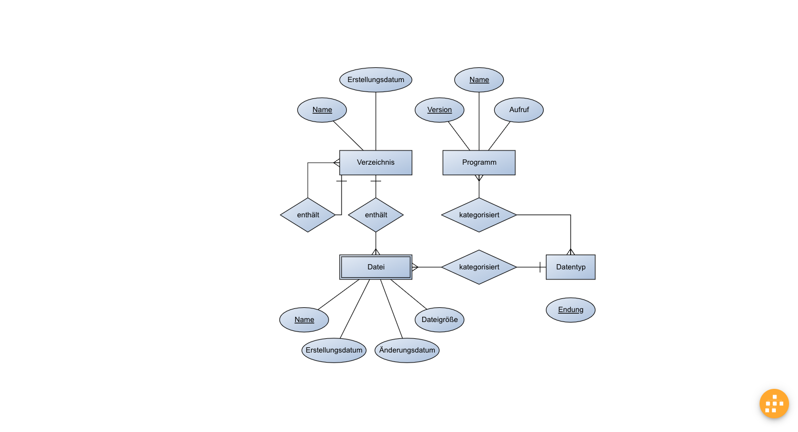

## Practical Session 3

### 3.1 Software Development

ERM for work projects with multi-level software components maintained by different project teams, including team leaders and developers and several sets of relations to each other.

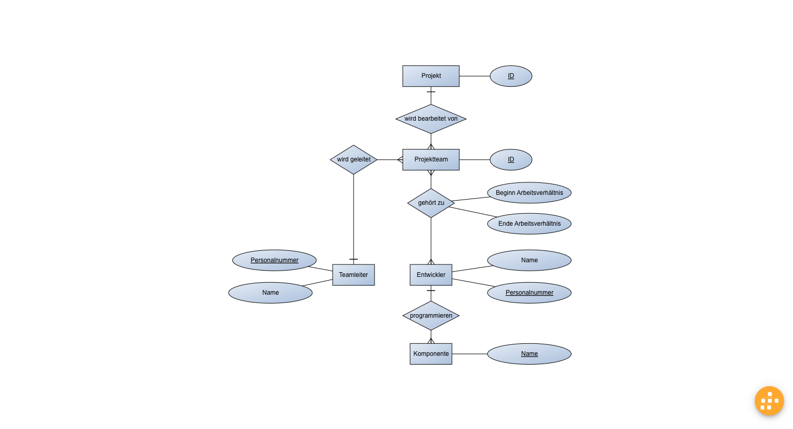
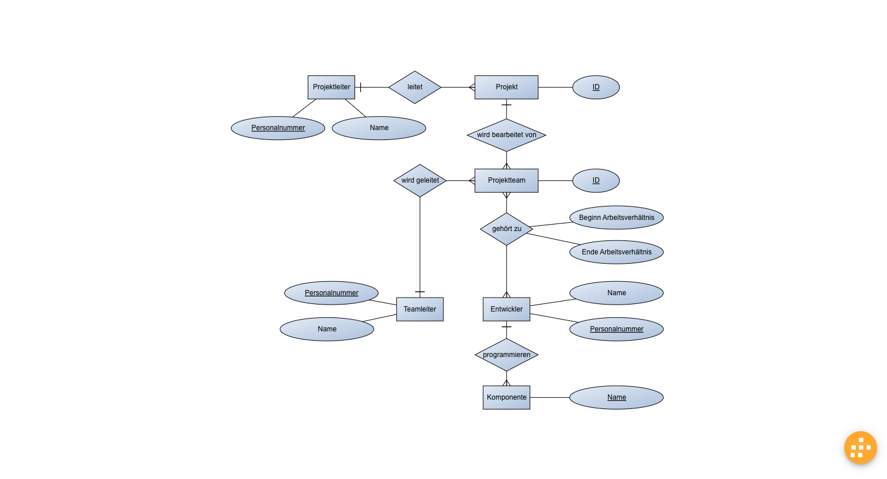
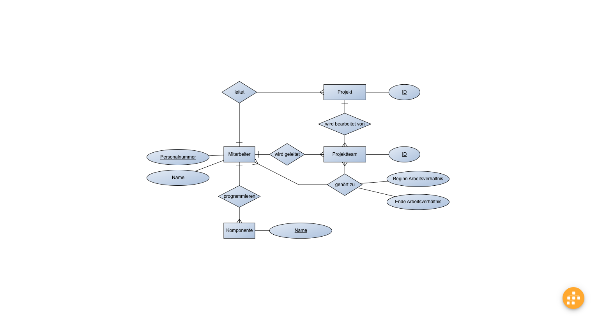

### 3.2 Research Studies

ERM for storing measured values after performing a series of tests for research projects handled by universities that can cooperate.

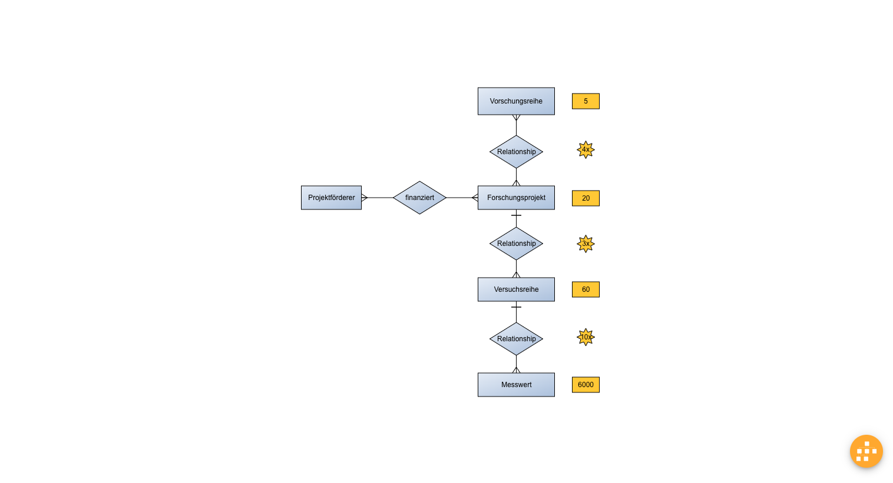

## Practical Session 4

### 4.1 Web Server

Entity type diagram to manage the access logs of various web servers.

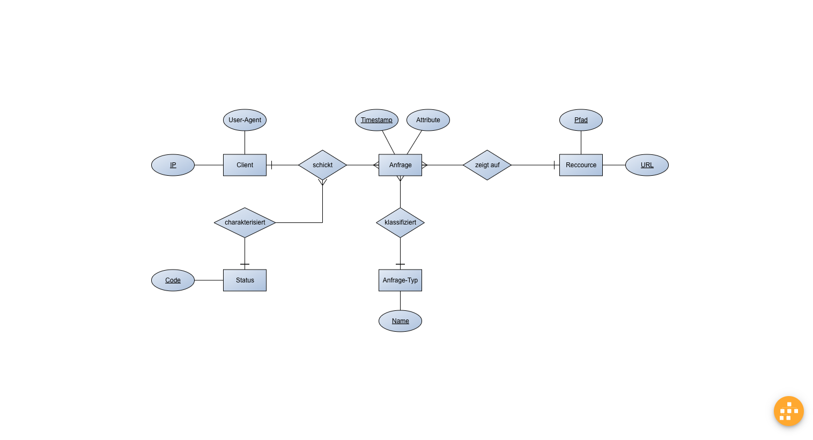

### 4.2 Biological Survey

Entity type diagram to describe species data sets and classify them taxonomically.

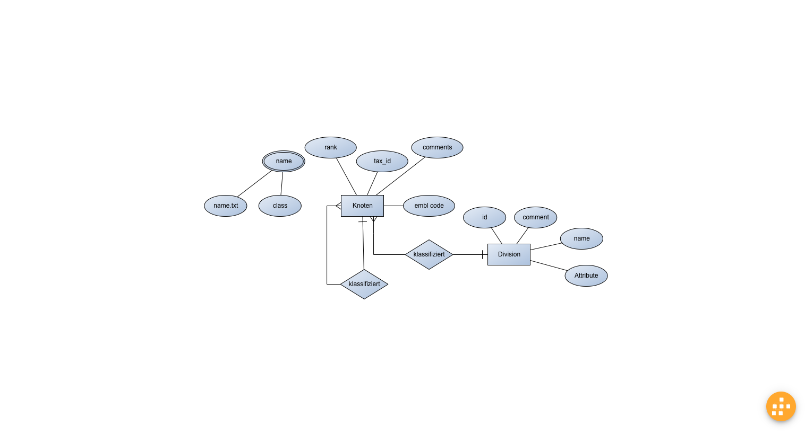
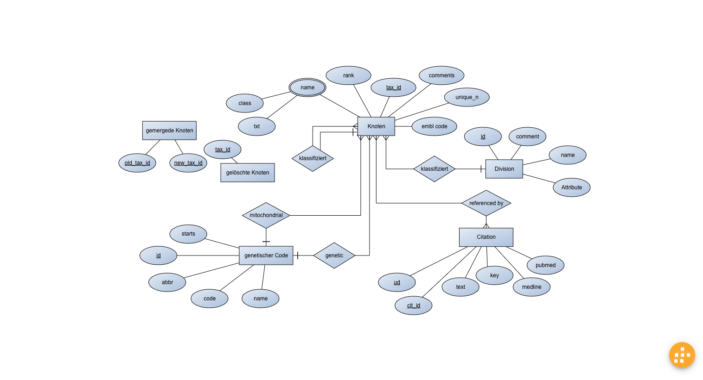

## Practical Session 5

### 5.2 Transformation

Transforming the given ERM into an relational model with a minimal relation tree and keys for the referential integrity.

#### Template

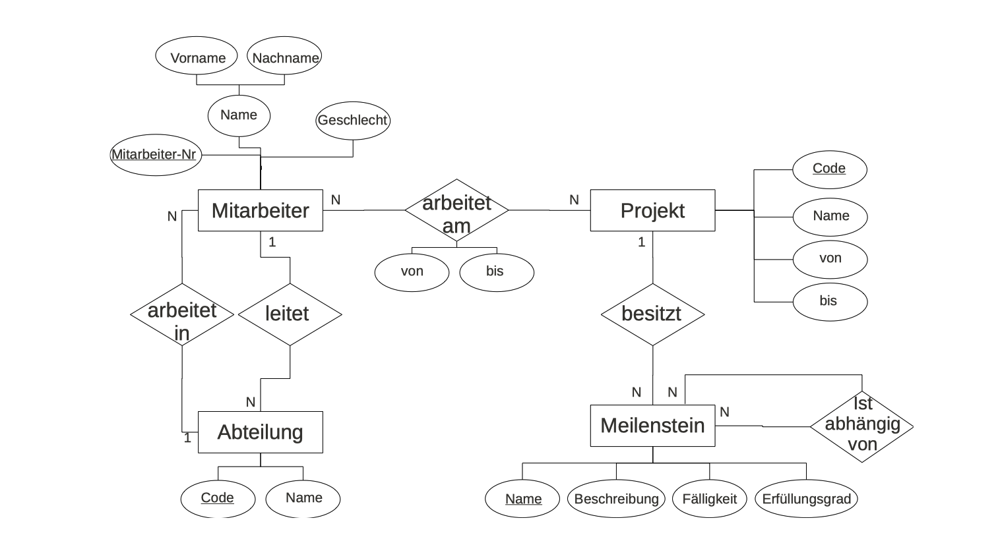

#### Structure

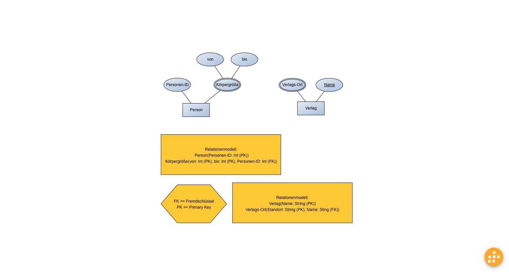

#### Outcome

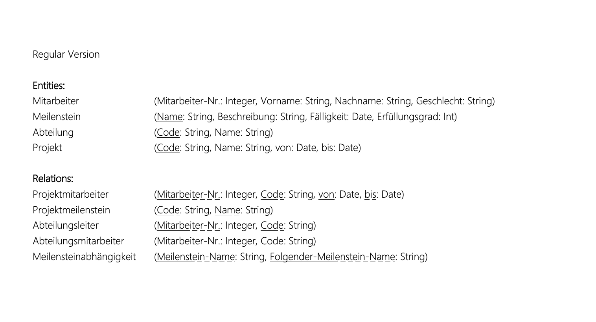
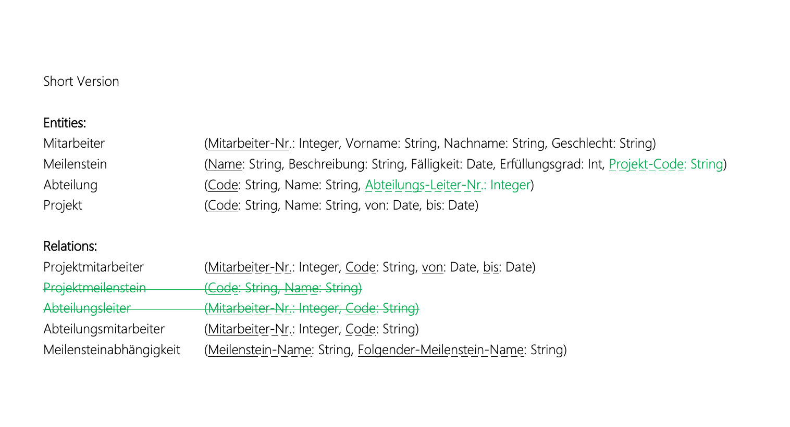
